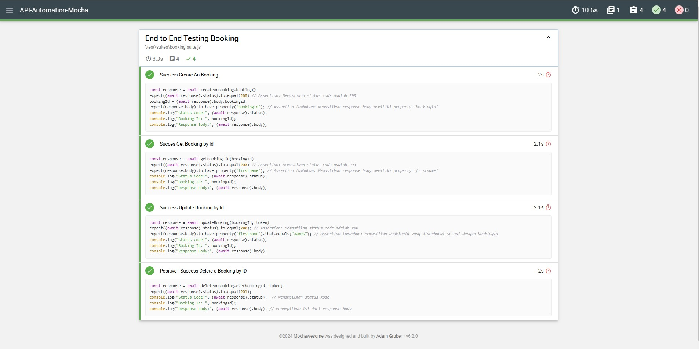

# API Automation Mocha Chai Suppertest

Repository for Learning Software Quality Assurance - API Automation Mocha-Chai Supertest Practice

<p align="center">
    
</p>

This repository is the result of a personal project practice aimed at learning and applying API automation testing techniques using Mocha, Chai, and Supertest. The main focus of this project is to validate the core functionalities of a booking system through end-to-end tests, covering the CRUD of bookings.

## Note

- The code structure in this repository is still unorganized as it's part of a practice project. However, the test file `booking.suite.js` is structured properly, and it utilizes functions from the `function` folder to handle API requests and responses efficiently.
- The functions are modularized into separate files within the `function` folder, which helps in keeping the main test file clean and maintainable.

## API Source

This project uses the [Restful Booker API](https://restful-booker.herokuapp.com/apidoc/index.html) as the backend for testing the booking functionalities. The API provides endpoints for CRUD bookings, which are utilized in the tests.

## Features

- **End-to-End Testing:** Comprehensive tests covering the entire booking lifecycle, from create to delete on booking.suite.js.
- **Assertions with Chai:** Validates expected outcomes from API responses, ensuring data integrity and correct status codes.
- **Mocha Hooks:** Uses Mocha's `before` hook to set up necessary preconditions, such as generating a token for authentication.

## Technologies Used

- **Mocha:** A JavaScript testing framework for running asynchronous tests.
- **Chai:** An assertion library for Node.js and browsers that can be paired with any JavaScript testing framework.
- **Supertest:** A library for testing HTTP calls in Node.js applications.

## Getting Started

### Prerequisites

Ensure that you have the following software installed on your machine:

- [Node.js](https://nodejs.org/) (version 14 or higher)
- npm (Node package manager)

### Installation

1. Clone this repository:

   ```bash
   git clone https://github.com/yourusername/api-automation-booking.git
   cd api-automation-booking
   ```
2. Install Mocha
    ```bash
    npm install mocha
    ```
3. Install Chai
    ```bash
    npm install chai
    ```
4. Install Superterst
    ```bash
    npm install supertest
    ```
5. Install Mochawesome
    ```bash
    npm install mochawesome mocha --save-dev
    ```
6. Running The Test booking.suite.js
    ```bash
    npm run test:booking
    ```

## Test Structure

The tests are organized as follows:

### End to End Testing Booking
1. **POST /booking** - Create booking
    - Create a new Booking in the system
    - **Assertions**:
        - Response status code should be `200`.
        - Response body should contain a `bookingid` property.

2. **GET /booking/:id** - Read booking
    - Read a new Booking in the system by ID
    - **Assertions**:
        - Response status code should be `200`.
        - Response body should contain a `firstname` property.

3. **PUT /booking/:id** - Update booking
    - Update a Booking in the system by ID
    - **Assertions**:
        - Response status code should be `200`.
        - Response body should contain a `firstname` property thats to equals `James`.

4. **DELETE /booking/:id** - Delete booking
    - Deletee a Booking in the system by ID
    - **Assertions**:
        - Response status code should be `201`.

## Screenshot of Mochawesome Reporter

